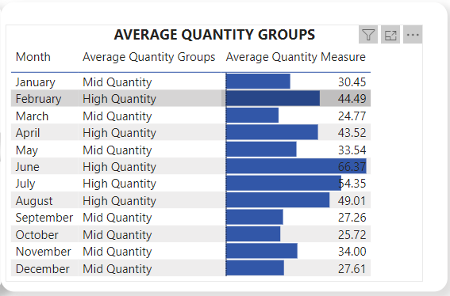

# SALES-REPORT (Tasks and Instructions)

## This sales report is created as part of my training exercise, it showcases the ETL process using SQL, analysis and reporting with Power BI dashboarding techniques and documentation using the markdown language.

# Introduction
This is a training exercise with the following tasks:

- Import Database Adveturework2014 into SSMS from the web URL (https://1drv.ms/u/s!AiZu-urEabOdgYIlFcCGIxckz7l6Mg?e=uwNFy0)
- Connect Power BI to SQL Database and import Table Product Transaction History, Sales CurrencyRate, and Sales Order Detail from Database Adveturework2014.

- Using Table Product Transaction History create:
  1. A visual showing the actual Cost for each Transaction Type on a month-to-month.
  2. A table showing the category of Average Quantity into 3 groups, High Quantity, Mid Quantity, and Low Quantity.
  3. A visual showing the total Actual Cost for each Transaction Type.
  4. Create a dashboard for tasks 1, 2, and 3.

- Give an insight into the trend of data in Table Sales Currency Rate, back up insights with visuals
- Design three visuals and an interactive dashboard from Table Sales Sales Order Detail 

# Skills Demonstrated
- ETL process
- Data analysis using DAX queries
- Visualisation in Power BI with page navigation
- Drawing insights from visualisations

### ETL Process
I was able to perform the ETL process by extracting and transforming data with SQL to generate the following tables Product transaction history, Sales currency rate and Sales order details, I also imported the tables into Power BI to complete the the ETL process before analysing the data.

### Data analysis using DAX queries
In analysing the data, I used some simple DAX queries to generate average quantities which helped me group the data and aided my analysis.

### Visualisation in Power BI with page navigation
I was able to employ some of the skills I learned from Bas, How to Power BI (https://www.youtube.com/@HowtoPowerBI) and ExcelFort (https://www.youtube.com/@ExcelFort) on YouTube which assisted me in formatting my dashboard and visuals in Power BI and also created page navigation to go through the pages of my Power BI report.

### Drawing insights from visualisations
I was able to draw the following insights from the dashboards created from the analysed data:

